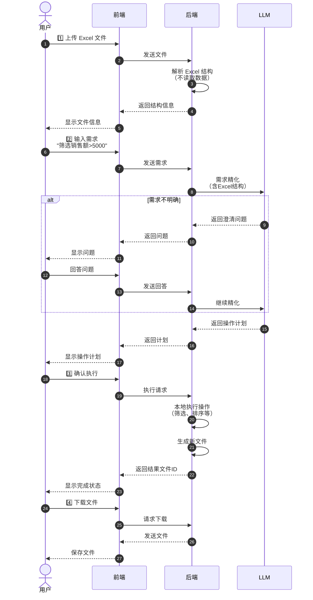

# LLM-Excel-Copilot

<p align="center">
  <strong>🤖 AI 驱动的 Excel 数据分析助手</strong>
</p>

<p align="center">
  <a href="#特性">特性</a> •
  <a href="#快速开始">快速开始</a> •
  <a href="#使用方法">使用方法</a> •
  <a href="#配置说明">配置说明</a> •
  <a href="#常见问题">常见问题</a> •
  <a href="#项目结构">项目结构</a>
</p>

<p align="center">
  <a href="./README_EN.md">English</a> | 中文
</p>

---

LLM-Excel-Copilot 是一个基于大语言模型的智能 Excel 数据分析工具。只需用自然语言描述你的分析需求，AI 会自动完成数据处理。

## 🎬 演示视频

<p align="center">
  <video src="https://github.com/user-attachments/assets/your-video-id-here.mp4" controls="controls" width="800">
    您的浏览器不支持 video 标签。请升级浏览器或<a href="docs/videos/demo-full-workflow.mp4">点击下载视频</a>查看演示。
  </video>
</p>


## 🏗️ 系统架构


## ✨ 特性

- 🔒 **隐私优先** - Excel 数据保留在本地，仅发送结构信息给 AI
- 🤖 **多模型支持** - 兼容 OpenAI、DeepSeek、通义千问、硅基流动等 OpenAI 兼容 API
- 📊 **自然语言分析** - 用自然语言描述需求，AI 自动分析数据
- 💬 **智能澄清** - 需求不明确时，AI 会主动询问确认
- ⚡ **实时响应** - 实时显示 AI 思考和分析过程
- 🔄 **多 API 管理** - 通过 Web 界面配置多个 API，轻松切换
- 📁 **多格式支持** - 支持 .xlsx 和 .xls 文件
- 📈 **图表生成** - 自动生成柱状图、折线图、饼图等

### 🎯 支持的操作类型

<details>
<summary>点击展开查看 20+ 种操作</summary>

#### 数据筛选与排序
- **筛选 (FILTER)** - 条件筛选保留符合条件的行
- **排序 (SORT)** - 按列升序/降序排序

#### 列操作
- **添加列 (ADD_COLUMN)** - 新增计算列（支持公式）
- **删除列 (DELETE_COLUMN)** - 删除指定列
- **拆分列 (SPLIT_COLUMN)** - 按分隔符拆分列
- **合并列 (MERGE_COLUMNS)** - 合并多列为一列

#### 行操作
- **删除行 (DELETE_ROWS)** - 删除符合条件的行
- **去重 (DEDUPLICATE)** - 按列去除重复行

#### 数据处理
- **替换 (REPLACE)** - 批量替换值
- **填充 (FILL)** - 填充空值（前向/后向/固定值）
- **计算 (CALCULATE)** - 添加汇总行（求和/平均/计数等）

#### 格式化
- **格式化 (FORMAT)** - 数字/日期/百分比/货币格式
- **样式 (STYLE)** - 边框/背景色/字体样式

#### 高级操作
- **VLOOKUP** - 跨工作表查找匹配
- **数据透视 (PIVOT)** - 创建数据透视表
- **图表 (CREATE_CHART)** - 创建各类图表（含数据标签控制）

#### 多文件操作
- **纵向合并 (MERGE_VERTICAL)** - 追加数据行
- **横向合并 (MERGE_HORIZONTAL)** - 按关键列匹配合并

</details>

---

## 🚀 快速开始

### 1. 克隆仓库

```bash
git clone https://github.com/LouisUltra/LLM-Excel-Copilot.git
cd LLM-Excel-Copilot
```

### 2. 安装依赖

**方式一：使用 uv（推荐，自动管理虚拟环境）**

```bash
# 安装 uv（如果没有安装）
curl -LsSf https://astral.sh/uv/install.sh | sh

# 同步依赖
uv sync
```

**方式二：使用 pip + venv**

```bash
# 创建虚拟环境
python3 -m venv .venv
source .venv/bin/activate  # macOS/Linux
# 或者: .venv\Scripts\activate  # Windows

# 安装依赖
pip install -r requirements.txt
```

这将安装所有必需的包，包括：
- FastAPI（Web 框架）
- openpyxl、pandas、xlrd（Excel 处理）
- openai、httpx（LLM 客户端）
- matplotlib、pillow（图表生成）

### 3. 启动服务

**使用 uv（推荐）：**

```bash
uv run python -m app.main
```

**或使用激活的虚拟环境：**

```bash
# 确保已激活虚拟环境
source .venv/bin/activate  # macOS/Linux

# 使用 python3 运行（注意：某些系统没有 python 命令）
python3 -m app.main
```

浏览器打开：`http://localhost:8000`

> ⚠️ **注意**: macOS/Linux 系统可能没有 `python` 命令，请使用 `python3`。推荐使用 `uv run` 可以避免这类问题。

#### 停止服务

- **前台运行时**：在终端按 `Ctrl+C` 即可停止
- **后台运行时**：
  ```bash
  # 查找进程
  lsof -i :8000
  # 终止进程（替换 <PID> 为实际进程号）
  kill <PID>
  ```

### 4. 配置 API（首次使用）

#### 方式一：通过 Web 界面配置（推荐）

1. 点击右上角的 **⚙️ 设置** 按钮
2. 点击 **「+ 添加配置」**
3. 填写信息：
   - **配置名称**：例如 "OpenAI GPT-5"
   - **API 地址**：例如 `https://api.openai.com/v1`
   - **API Key**：你的密钥（sk-...）
   - **模型**：点击刷新按钮获取可用模型列表
4. 勾选 **「设为默认配置」**
5. 点击 **「保存」**

#### 方式二：手动创建配置文件

在项目根目录创建 `api_configs.json`：

```json
{
  "configs": [
    {
      "id": "default",
      "name": "OpenAI GPT-5",
      "api_key": "sk-your-api-key-here",
      "api_base": "https://api.openai.com/v1",
      "model": "gpt-5",
      "is_default": true
    }
  ]
}
```

#### 方式三：环境变量配置

基于 `.env.example` 创建 `.env` 文件：

```env
LLM_API_KEY=sk-your-api-key-here
LLM_API_BASE=https://api.openai.com/v1
LLM_MODEL=gpt-5
HOST=0.0.0.0
PORT=8000
DEBUG=true
```

#### 常用 API 配置参考

| 提供商 | API 地址 | 示例模型 |
|--------|---------|----------|
| **OpenAI** | `https://api.openai.com/v1` | gpt-5, gpt-5.1, gpt-5.2 |
| **DeepSeek** | `https://api.deepseek.com/v1` | deepseek-chat, deepseek-coder |
| **通义千问** | `https://dashscope.aliyuncs.com/compatible-mode/v1` | qwen-plus, qwen-turbo, qwen-max |
| **硅基流动** | `https://api.siliconflow.cn/v1` | Qwen/Qwen3-8B-Instruct |

---

## 📖 详细使用指南

### 📋 完整操作流程



### 基本流程

1. **上传文件** - 拖拽文件到上传区域，或点击选择文件
2. **描述需求** - 用自然语言输入你的分析需求
3. **回答问题** - 如果 AI 需要澄清，回答后续问题
4. **获取结果** - 查看分析结果并下载生成的文件

### 示例数据

假设你有一个销售数据表（销售记录.xlsx）：

| 日期 | 产品名称 | 销售额 | 数量 | 地区 |
|------|---------|--------|------|------|
| 2024-01-01 | 产品A | 5000 | 10 | 北京 |
| 2024-01-02 | 产品B | 3000 | 5 | 上海 |
| ... | ... | ... | ... | ... |

### 功能示例

**数据处理：**
```
"帮我按销售额从高到低排序"
"筛选出销售额大于 5000 的记录"
"删除重复的行"
"添加一列计算总额 = 数量 × 单价"
```

**数据统计：**
```
"在最后一行添加销售额的总和"
"按地区汇总销售额"
```

**格式调整：**
```
"给表格添加边框，标题行加粗，背景色改为浅蓝色"
```

**图表生成：**
```
"帮我画一个销售额的柱状图"
"用折线图展示月度趋势"
"做一个部门分布的饼图"
```

### 组合操作

可以一次描述多个需求：

```
"先筛选出北京地区的数据，
 然后按销售额排序，
 最后生成一个柱状图"
```

AI 会逐步询问确认，确保理解正确。

---

## 🔐 隐私保护

本工具遵循 **「只传结构，不传数据」** 的设计原则：

1. Excel 文件始终保留在你的本地机器
2. 只有**结构信息**会发送给 AI：
   - 列标题
   - 数据类型
   - 行数统计
   - 公式/合并单元格标识
3. **实际数据内容永远不会离开你的电脑**
4. AI 返回操作指令，由本地 Python 执行

---

## ❓ 常见问题

### Q1: 图表中文显示为方框？

**A:** 确保系统已安装中文字体：
- macOS：自带中文字体，重启应用即可
- Windows：确保安装了宋体、微软雅黑等
- Linux：`sudo apt-get install fonts-wqy-microhei`

### Q2: API 调用失败？

**A:** 检查以下几点：
1. API Key 是否正确
2. 网络是否连接
3. 账户余额是否充足
4. API 地址是否正确

### Q3: AI 理解错误？

**A:** 尝试：
1. 更详细地描述需求
2. 分步骤描述（不要一次性说太多）
3. 使用实际的列名
4. 查看 AI 的理解，及时纠正

### Q4: 操作失败？

**A:** 查看错误提示：
- 列名是否拼写正确
- 数据类型是否匹配（数字列不能包含文字）
- 操作参数是否完整

---

## 🎯 最佳实践

### ✅ 推荐做法

1. **明确指定列名**
   ```
   ✅ "按'销售额'列从高到低排序"
   ❌ "排个序"
   ```

2. **分步骤操作**
   ```
   ✅ 第一步："筛选出销售额大于5000的"
      第二步："然后按日期排序"
   ❌ "筛选销售额大于5000然后排序然后去重然后..."
   ```

3. **使用实际列名**
   ```
   ✅ "用'产品名称'和'销售额'画柱状图"
   ❌ "画个图"
   ```

### ❌ 避免做法

1. 一次性要求太多操作
2. 使用模糊的描述
3. 不确认就执行
4. 跳过需求澄清步骤

---

## 📁 项目结构

```
LLM-Excel-Copilot/
├── app/
│   ├── main.py              # FastAPI 主应用入口
│   ├── models.py            # Pydantic 数据模型
│   ├── config.py            # 配置管理 (pydantic-settings)
│   ├── core/
│   │   ├── api_manager.py   # 多 API 管理
│   │   ├── llm_client.py    # LLM 客户端封装
│   │   ├── excel_parser.py  # Excel 文件解析器
│   │   ├── excel_executor.py # Excel 操作执行器
│   │   └── requirement_refiner.py # 需求澄清模块
│   └── static/
│       ├── index.html       # 前端主页
│       ├── styles.css       # 样式表
│       ├── app.js           # 主应用逻辑
│       └── streaming.js     # 流式响应处理器
├── tests/                   # 单元测试
├── uploads/                 # 上传文件目录
├── outputs/                 # 处理后文件目录
├── api_configs.json         # API 配置（自动生成）
├── requirements.txt         # Python 依赖
├── .env.example             # 环境变量模板
├── .env                     # 本地配置（不在 git 中）
└── README.md
```

## 🛠️ 技术栈

- **后端**: FastAPI + Python 3.8+
- **前端**: 原生 JavaScript + CSS
- **数据处理**: Pandas + OpenPyXL + xlrd
- **图表**: Matplotlib + Pillow
- **LLM 集成**: OpenAI 兼容 API (openai + httpx)

## 📝 API 文档

启动服务后访问：

- Swagger UI: http://localhost:8000/docs
- ReDoc: http://localhost:8000/redoc

## 🤝 贡献

欢迎贡献代码！请随时提交 Pull Request。

1. Fork 本仓库
2. 创建功能分支 (`git checkout -b feature/AmazingFeature`)
3. 提交更改 (`git commit -m 'Add some AmazingFeature'`)
4. 推送到分支 (`git push origin feature/AmazingFeature`)
5. 打开 Pull Request

## 📄 许可证

本项目采用 MIT 许可证 - 详见 [LICENSE](LICENSE) 文件。

## ⭐ Star 历史

如果觉得这个项目有用，请考虑给它一个 Star！

---

## 📸 界面展示

### 主界面


### 文件信息展示


### 对话与操作计划


### 处理完成


### API 配置


### 多文件处理


---
