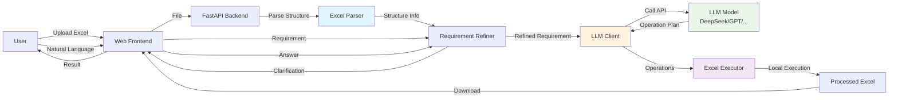
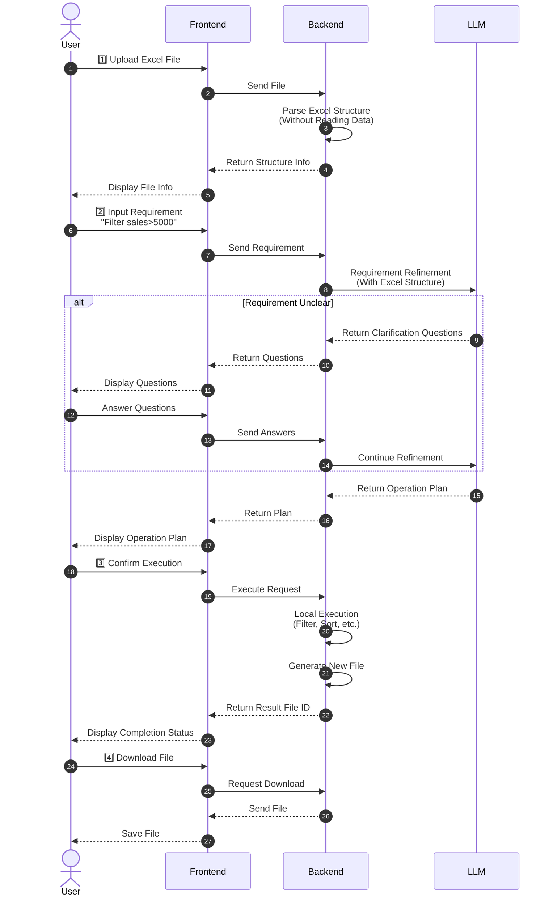
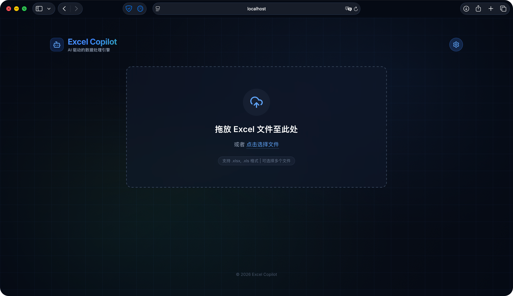
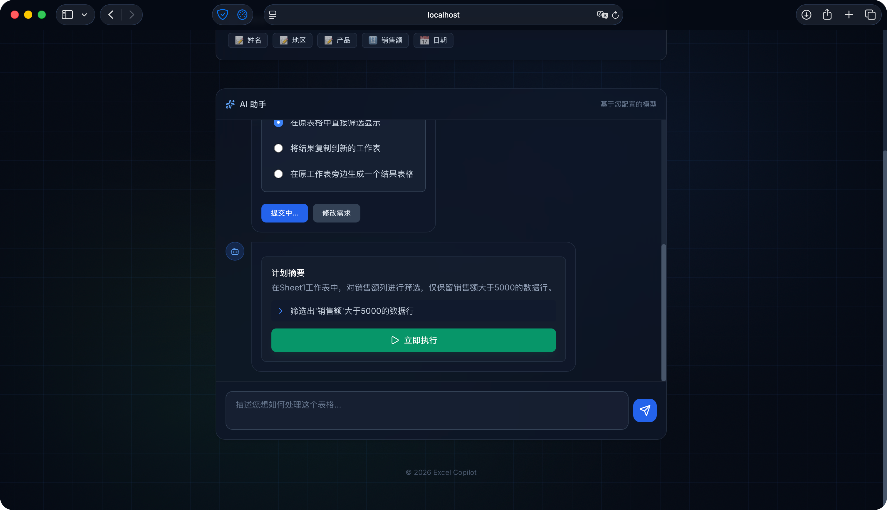
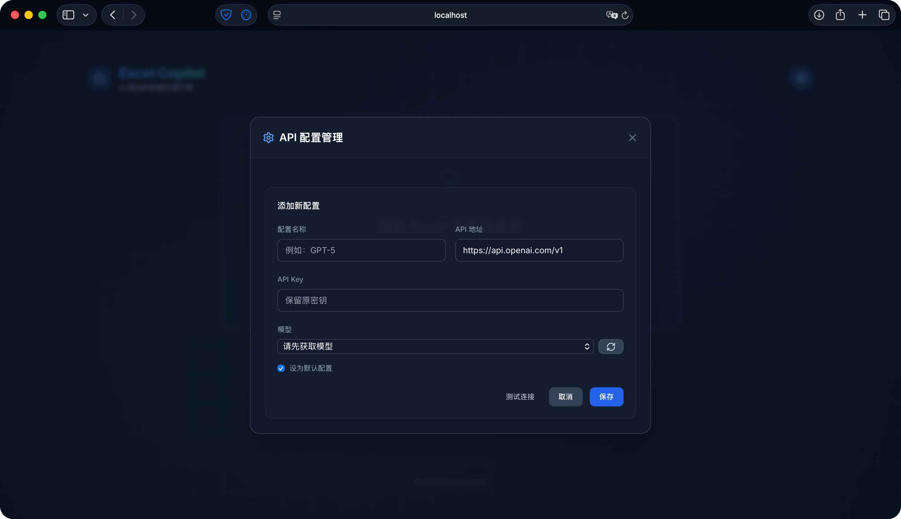
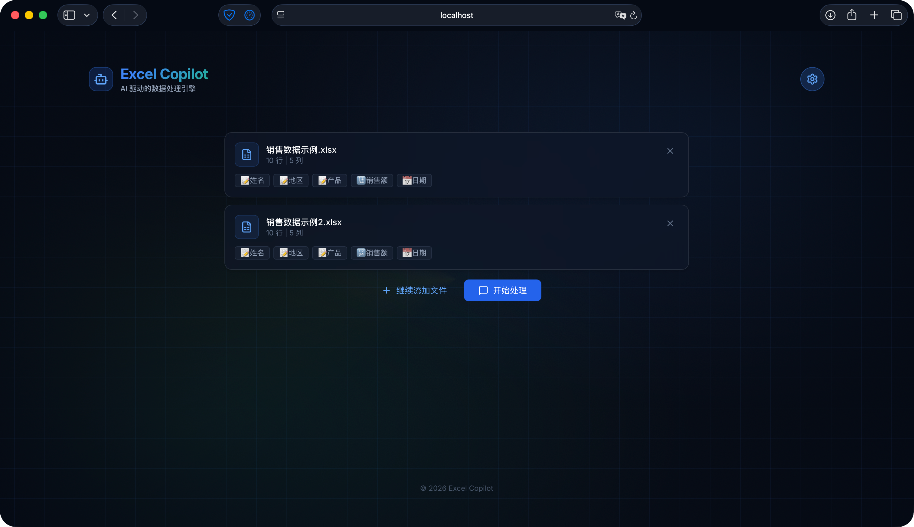

# LLM-Excel-Copilot

<p align="center">
  <strong>🤖 AI-Powered Excel Data Analysis Assistant</strong>
</p>

<p align="center">
  <a href="#features">Features</a> •
  <a href="#quick-start">Quick Start</a> •
  <a href="#usage">Usage</a> •
  <a href="#configuration">Configuration</a> •
  <a href="#troubleshooting">Troubleshooting</a> •
  <a href="#project-structure">Project Structure</a>
</p>

<p align="center">
  English | <a href="./README.md">中文</a>
</p>

---

LLM-Excel-Copilot is an intelligent Excel data analysis tool powered by Large Language Models. Simply describe your analysis needs in natural language, and let AI handle the rest.

## 🎬 Demo Video

<p align="center">
  <video src="https://github.com/user-attachments/assets/b0a1a02a-c39f-4f1d-8843-17fb264a5bc3" controls="controls" width="800">
    您的浏览器不支持 video 标签。请升级浏览器或<a href="docs/videos/demo-full-workflow.mp4">点击下载视频</a>查看演示。
  </video>
</p>  

## 🏗️ System Architecture




## ✨ Features

- 🔒 **Privacy First** - Your Excel data stays local; only structure info is sent to AI
- 🤖 **Multi-LLM Support** - Compatible with OpenAI, DeepSeek, Qwen (通义千问), SiliconFlow, and other OpenAI-compatible APIs
- 📊 **Natural Language Analysis** - Describe your needs in plain language, AI analyzes your data automatically
- 💬 **Smart Clarification** - AI asks clarifying questions when requirements are ambiguous
- ⚡ **Streaming Response** - Real-time display of AI thinking and analysis process
- 🔄 **Multi-API Management** - Configure multiple APIs via web interface with easy switching
- 📁 **Multiple Formats** - Support for .xlsx and .xls files
- 📈 **Chart Generation** - Automatically generate bar charts, line charts, pie charts, and more

### 🎯 Supported Operations

<details>
<summary>Click to expand 20+ operations</summary>

#### Data Filtering & Sorting
- **Filter (FILTER)** - Filter rows based on conditions
- **Sort (SORT)** - Sort by column in ascending/descending order

#### Column Operations
- **Add Column (ADD_COLUMN)** - Add calculated column (with formula support)
- **Delete Column (DELETE_COLUMN)** - Delete specified columns
- **Split Column (SPLIT_COLUMN)** - Split column by delimiter
- **Merge Columns (MERGE_COLUMNS)** - Merge multiple columns into one

#### Row Operations
- **Delete Rows (DELETE_ROWS)** - Delete rows matching conditions
- **Deduplicate (DEDUPLICATE)** - Remove duplicate rows by columns

#### Data Processing
- **Replace (REPLACE)** - Batch replace values
- **Fill (FILL)** - Fill empty values (forward/backward/fixed value)
- **Calculate (CALCULATE)** - Add summary row (sum/average/count, etc.)

#### Formatting
- **Format (FORMAT)** - Number/date/percentage/currency formatting
- **Style (STYLE)** - Borders/background colors/font styles

#### Advanced Operations
- **VLOOKUP** - Cross-sheet lookup and matching
- **Pivot (PIVOT)** - Create pivot tables
- **Chart (CREATE_CHART)** - Create various charts (with data label control)

#### Multi-file Operations
- **Vertical Merge (MERGE_VERTICAL)** - Append data rows
- **Horizontal Merge (MERGE_HORIZONTAL)** - Match and merge by key columns

</details>

---

## 🚀 Quick Start

### 1. Clone the Repository

```bash
git clone https://github.com/LouisUltra/LLM-Excel-Copilot.git
cd LLM-Excel-Copilot
```

### 2. Install Dependencies

**Option A: Using uv (Recommended, auto-manages virtual environment)**

```bash
# Install uv (if not installed)
curl -LsSf https://astral.sh/uv/install.sh | sh

# Sync dependencies
uv sync
```

**Option B: Using pip + venv**

```bash
# Create virtual environment
python3 -m venv .venv
source .venv/bin/activate  # macOS/Linux
# or: .venv\Scripts\activate  # Windows

# Install dependencies
pip install -r requirements.txt
```

This will install all required packages, including:
- FastAPI (Web framework)
- openpyxl, pandas, xlrd (Excel processing)
- openai, httpx (LLM client)
- matplotlib, pillow (Chart generation)

### 3. Start the Server

**Using uv (Recommended):**

```bash
uv run python -m app.main
```

**Or using activated virtual environment:**

```bash
# Make sure the virtual environment is activated
source .venv/bin/activate  # macOS/Linux

# Use python3 to run (note: some systems don't have 'python' command)
python3 -m app.main
```

Open your browser and go to: `http://localhost:8000`

> ⚠️ **Note**: macOS/Linux systems may not have the `python` command, use `python3` instead. Using `uv run` is recommended to avoid such issues.

#### Stop the Server

- **Running in foreground**: Press `Ctrl+C` in the terminal
- **Running in background**:
  ```bash
  # Find the process
  lsof -i :8000
  # Kill the process (replace <PID> with actual process ID)
  kill <PID>
  ```

### 4. Configure API (First Time)

#### Option A: Via Web Interface (Recommended)

1. Click the **⚙️ Settings** button in the top right corner
2. Click **"+ Add Configuration"**
3. Fill in the details:
   - **Configuration Name**: e.g., "OpenAI GPT-5"
   - **API Address**: e.g., `https://api.openai.com/v1`
   - **API Key**: Your key (sk-...)
   - **Model**: Click the refresh button to get available models
4. Check **"Set as Default"**
5. Click **"Save"**

#### Option B: Manual Configuration File

Create `api_configs.json` in the project root:

```json
{
  "configs": [
    {
      "id": "default",
      "name": "OpenAI GPT-5",
      "api_key": "sk-your-api-key-here",
      "api_base": "https://api.openai.com/v1",
      "model": "gpt-5",
      "is_default": true
    }
  ]
}
```

#### Option C: Environment Variables

Create a `.env` file based on `.env.example`:

```env
LLM_API_KEY=sk-your-api-key-here
LLM_API_BASE=https://api.openai.com/v1
LLM_MODEL=gpt-5
HOST=0.0.0.0
PORT=8000
DEBUG=true
```

#### Common API Configuration Reference

| Provider | API Base URL | Example Models |
|----------|-------------|----------------|
| **OpenAI** | `https://api.openai.com/v1` | gpt-5, gpt-5.1, gpt-5.2 |
| **DeepSeek** | `https://api.deepseek.com/v1` | deepseek-chat, deepseek-coder |
| **Alibaba Qwen** | `https://dashscope.aliyuncs.com/compatible-mode/v1` | qwen-plus, qwen-turbo, qwen-max |
| **SiliconFlow** | `https://api.siliconflow.cn/v1` | Qwen/Qwen3-8B-Instruct |

---

## 📖 Usage Guide

### 📋 Complete Operation Flow



### Basic Workflow

1. **Upload File** - Drag and drop your file to the upload area, or click to select
2. **Describe Your Need** - Enter your analysis requirement in natural language
3. **Answer Questions** - If AI needs clarification, answer the follow-up questions
4. **Get Results** - View analysis results and download generated files

### Example Data

Suppose you have a sales data spreadsheet (sales_records.xlsx):

| Date | Product Name | Revenue | Quantity | Region |
|------|-------------|---------|----------|--------|
| 2024-01-01 | Product A | 5000 | 10 | Beijing |
| 2024-01-02 | Product B | 3000 | 5 | Shanghai |
| ... | ... | ... | ... | ... |

### Feature Examples

**Data Processing:**
```
"Sort by revenue from highest to lowest"
"Filter records where revenue is greater than 5000"
"Remove duplicate rows"
"Add a column to calculate total = quantity × price"
```

**Data Aggregation:**
```
"Add the sum of revenue in the last row"
"Summarize revenue by region"
```

**Formatting:**
```
"Add borders to the table, make the header bold with a light blue background"
```

**Chart Generation:**
```
"Create a bar chart of revenue"
"Show monthly trends with a line chart"
"Make a pie chart of department distribution"
```

### Combined Operations

You can describe multiple requirements at once:

```
"First filter data for Beijing region,
 then sort by revenue,
 finally create a bar chart"
```

AI will confirm each step to ensure correct understanding.

---

## 🔐 Privacy Protection

This tool follows a **"structure only, no data"** design principle:

1. Excel files always stay on your local machine
2. Only **structural information** is sent to AI:
   - Column headers
   - Data types
   - Row counts
   - Formula/merged cell indicators
3. **Actual data content never leaves your computer**
4. AI returns operation instructions, executed locally by Python

---

## ❓ Troubleshooting

### Q1: Chinese characters appear as boxes in charts?

**A:** Make sure Chinese fonts are installed:
- macOS: Built-in Chinese fonts, restart the app
- Windows: Ensure SimHei or Microsoft YaHei is installed
- Linux: `sudo apt-get install fonts-wqy-microhei`

### Q2: API call failed?

**A:** Check these items:
1. Is the API Key correct?
2. Is your network connected?
3. Is your account balance sufficient?
4. Is the API address correct?

### Q3: AI misunderstands my request?

**A:** Try:
1. Describe your need in more detail
2. Break it into steps (don't say too much at once)
3. Use actual column names
4. Review AI's understanding and correct if needed

### Q4: Operation failed?

**A:** Check the error message:
- Is the column name spelled correctly?
- Do data types match (numeric columns shouldn't contain text)?
- Are operation parameters complete?

---

## 🎯 Best Practices

### ✅ Recommended

1. **Specify column names clearly**
   ```
   ✅ "Sort by 'Revenue' column from high to low"
   ❌ "Sort it"
   ```

2. **Work in steps**
   ```
   ✅ Step 1: "Filter records where revenue > 5000"
      Step 2: "Then sort by date"
   ❌ "Filter revenue > 5000 then sort then dedupe then..."
   ```

3. **Use actual column names**
   ```
   ✅ "Create a bar chart with 'Product Name' and 'Revenue'"
   ❌ "Make a chart"
   ```

### ❌ Avoid

1. Requesting too many operations at once
2. Using vague descriptions
3. Executing without confirmation
4. Skipping clarification steps

---

## 📁 Project Structure

```
LLM-Excel-Copilot/
├── app/
│   ├── main.py              # FastAPI main application entry point
│   ├── models.py            # Pydantic data models
│   ├── config.py            # Configuration management (pydantic-settings)
│   ├── core/
│   │   ├── api_manager.py   # Multi-API management with failover
│   │   ├── llm_client.py    # LLM client wrapper (OpenAI-compatible)
│   │   ├── excel_parser.py  # Excel file parser (structure extraction)
│   │   ├── excel_executor.py # Excel operation executor
│   │   └── requirement_refiner.py # Requirement clarification via AI
│   └── static/
│       ├── index.html       # Frontend main page
│       ├── styles.css       # Stylesheet
│       ├── app.js           # Main application logic
│       └── streaming.js     # Streaming response handler
├── tests/                   # Unit tests
├── uploads/                 # Uploaded files directory
├── outputs/                 # Processed files directory
├── api_configs.json         # API configurations (auto-generated)
├── requirements.txt         # Python dependencies
├── .env.example             # Environment template
├── .env                     # Local configuration (not in git)
└── README.md
```

## 🛠️ Tech Stack

- **Backend**: FastAPI + Python 3.8+
- **Frontend**: Vanilla JavaScript + CSS
- **Data Processing**: Pandas + OpenPyXL + xlrd
- **Charts**: Matplotlib + Pillow
- **LLM Integration**: OpenAI-compatible API (openai + httpx)

## 📝 API Documentation

After starting the server, visit:

- Swagger UI: http://localhost:8000/docs
- ReDoc: http://localhost:8000/redoc

## 🤝 Contributing

Contributions are welcome! Please feel free to submit a Pull Request.

1. Fork the repository
2. Create your feature branch (`git checkout -b feature/AmazingFeature`)
3. Commit your changes (`git commit -m 'Add some AmazingFeature'`)
4. Push to the branch (`git push origin feature/AmazingFeature`)
5. Open a Pull Request

## 📄 License

This project is licensed under the MIT License - see the [LICENSE](LICENSE) file for details.

## ⭐ Star History

If you find this project useful, please consider giving it a star!

---

## 📸 Interface Showcase

### Main Interface


### File Information Display


### Chat and Operation Plan



### Processing Complete


### API Configuration


### Multi-file Processing


---
